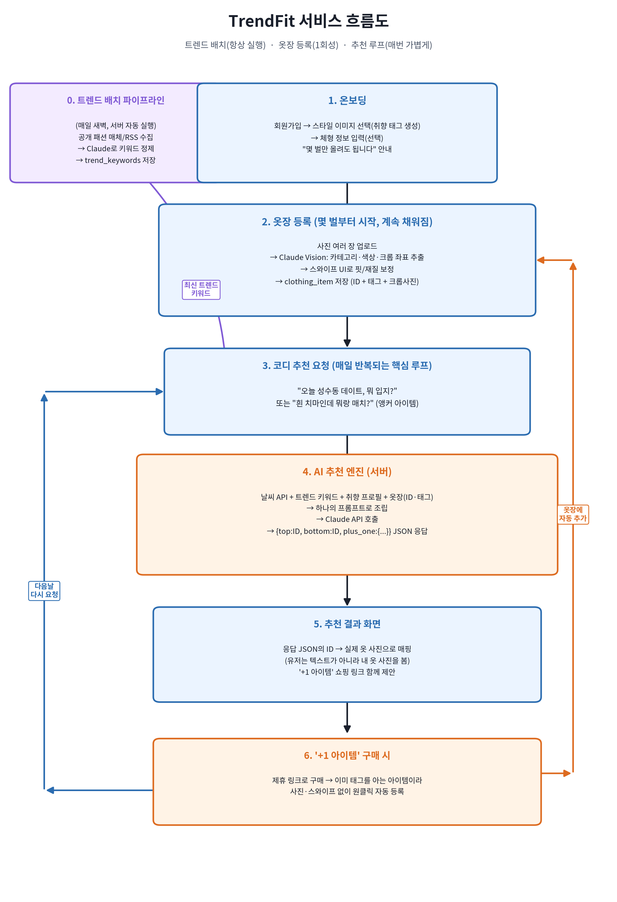

# 💡 TrendFit

> 최신 패션 트렌드를 자동으로 수집하고, 이를 **내가 가진 옷**으로 번역해주는 AI 퍼스널 스타일리스트

[]()
[]()
[]()
[]()

## 한 줄 정의

유행에 관심 많은 사람을 위한, "요즘 유행을 내 옷으로 어떻게 입지?"에 답하는 자동 코디 추천 서비스입니다.

## 왜 만드나요

기존 디지털 옷장 앱들(에이클로젯 등)은 **보유 의류를 정리·관리**하는 데 강점이 있지만, **지금 바깥에서 뜨는 유행을 실시간으로 반영**하지는 않는다는 공백을 확인했습니다. TrendFit은 매일 자동 수집되는 트렌드 데이터를 사용자의 옷장과 결합해, "유행을 새로 사는 것"이 아니라 "내 옷을 재조합하는 것"으로 해결합니다.

자세한 배경, 문제 정의, 경쟁 분석, 아키텍처는 **[docs/PRD.md](./docs/PRD.md)** 에 정리되어 있습니다.
발표 자료는 [docs/PITCH.md](./docs/PITCH.md)(1분/3분 피칭 대본), [docs/QA.md](./docs/QA.md)(예상 Q&A 25개)를 참고하세요.

## 핵심 기능

1. **트렌드 수집·정제 파이프라인** — 공개 패션 매체를 매일 수집해 Claude가 컬러·아이템·무드 키워드로 구조화
2. **옷장 등록** — 사진 업로드 → Vision 자동 태깅 + 크롭 → 스와이프로 1초 보정
3. **트렌드 번역 추천 엔진** — 트렌드 + 취향 + 옷장 + 날씨를 조합해 "내 옷으로 완성하는 오늘의 코디" 제안, 부족한 아이템은 '+1 아이템'으로 제안하고 구매 시 자동 등록

## 서비스 흐름도



## 기술 스택

| 영역 | 기술 |
|---|---|
| 프론트엔드 | Flutter |
| 백엔드 | Java 17, Spring Boot 3, Spring Data JPA |
| 데이터베이스 | MySQL (Docker) |
| AI | Claude API (Vision + Text) |
| 외부 연동 | 공공 날씨 API |

## 프로젝트 구조

```
trendfit/
├── docs/
│   ├── PRD.md          # 상세 기획서 (문제 정의, 경쟁 분석, 아키텍처, 로드맵)
│   └── flowchart.png   # 서비스 흐름도
├── backend/             # Spring Boot REST API
│   └── src/main/java/com/trendfit/
│       ├── domain/
│       │   ├── user/            # User, UserPreference
│       │   ├── closet/          # ClothingItem
│       │   ├── trend/           # TrendKeyword, 트렌드 배치 스케줄러
│       │   └── recommendation/  # RecommendationLog, 추천 엔진
│       └── global/config/       # 공통 설정 (AI 클라이언트, CORS 등)
└── app/                  # Flutter 앱
    └── lib/
        ├── screens/
        ├── models/
        ├── services/
        └── widgets/
```

## 로컬 실행 방법

### 1. 백엔드 (Spring Boot)

```bash
cd backend
# MySQL 컨테이너 실행
docker compose up -d

# application.yml 에 Claude API 키 등 환경변수 설정 후
./gradlew bootRun
```

> `gradlew` 실행 파일이 없다면 IntelliJ에서 프로젝트를 열거나, 로컬에 Gradle이 설치되어 있다면 `gradle wrapper` 명령으로 생성할 수 있습니다.

### 2. 앱 (Flutter)

```bash
cd app
flutter create . --project-name trendfit   # 최초 1회: iOS/Android 플랫폼 폴더 생성
flutter pub get
flutter run
```

## 개발 로드맵 (6주 MVP)

| 주차 | 목표 |
|---|---|
| 1주차 | 환경 구축 + 트렌드 수집 PoC |
| 2주차 | 트렌드 정제 파이프라인 |
| 3주차 | 옷장 등록 (Vision 태깅 + 크롭) |
| 4주차 | 트렌드 번역 추천 엔진 (핵심) |
| 5주차 | Flutter 앱 연동 |
| 6주차 | 마무리 및 데모 |

자세한 일정과 마일스톤은 [docs/PRD.md - 10. 개발 로드맵](./docs/PRD.md#10-개발-로드맵-6주)을 참고하세요.

## 라이선스

이 프로젝트는 [MIT License](./LICENSE)를 따릅니다.

---

작년 자바 수업에서 만들었던 옷장 프로토타입(`MyCloset`)을 방학 동안 AI 기반으로 제대로 다시 만들어보는 개인 프로젝트입니다.
