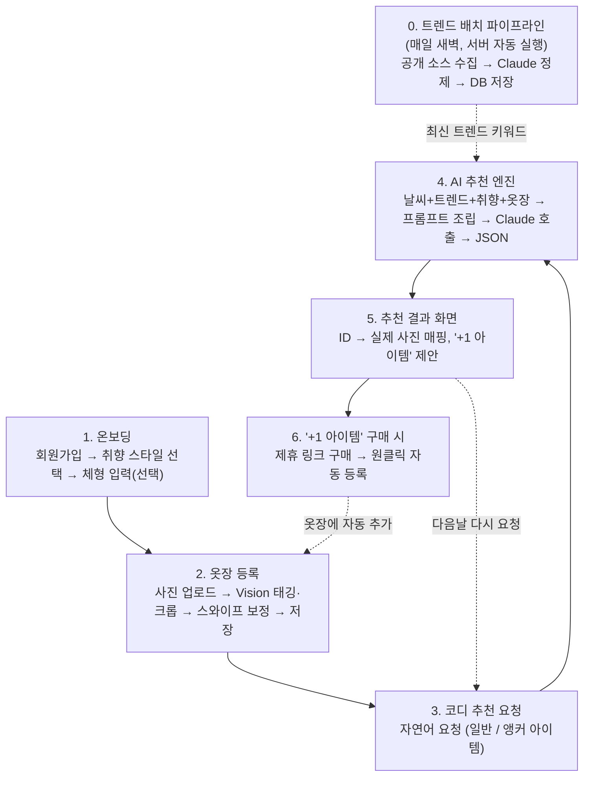
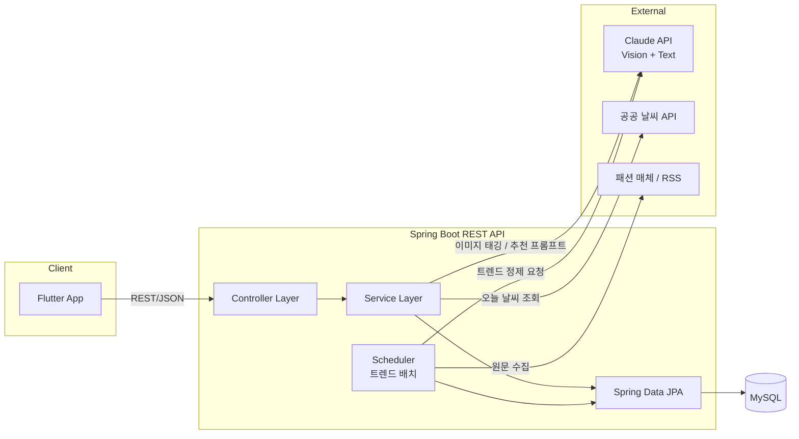

# TrendFit — Product Requirements Document (PRD)

| 항목 | 내용 |
|---|---|
| 문서 버전 | v1.0 |
| 작성자 | 지원 (1인 개발) |
| 작성 목적 | 방학 개인 프로젝트 기획서 / 과제 제출용 / GitHub 포트폴리오용 |
| 개발 기간 | 6주 (MVP) |
| 상태 | 기획 확정, 개발 착수 전 |

---

## 0. Executive Summary

**TrendFit**은 "요즘 유행하는 스타일을, 내가 이미 가진 옷으로 어떻게 소화할지"라는 질문에 답하는 AI 퍼스널 스타일리스트 서비스다. 매일 자동 수집·정제되는 패션 트렌드 데이터를, 사용자의 옷장(디지털화된 의류 데이터)과 개인 취향 프로필에 결합하여, 사용자가 실제로 보유한 옷만으로 구성 가능한 코디를 제안한다. 부족한 아이템이 있을 경우 최소한의 구매("+1 아이템")를 제안하고, 구매 시 자동으로 옷장에 등록되는 폐쇄 루프(closed loop)를 형성한다.

기존 디지털 옷장 서비스(에이클로젯 등)가 "보유 의류의 정리·관리·조합"에 강점을 갖는 반면, 외부 트렌드 신호를 실시간으로 반영하지는 않는다는 점이 확인되었으며, TrendFit은 이 지점을 제품의 핵심 차별점으로 설정한다.

---

## 1. 배경 및 동기 (Background)

### 1.1 문제 인식의 시작

작성자는 작년 대학 Java 수업에서 "오늘 뭐 입지"라는 개인적 불편에서 출발해 `MyCloset`이라는 옷장 관리 프로토타입을 제작한 경험이 있다. 다만 해당 프로젝트는 학습 목적의 단기 과제였기 때문에, 무신사 등에서 수집한 샘플 이미지 몇 장을 등록해두고 상의·하의를 무작위로 매칭해 보여주는 수준에 머물렀다 — 실제 사용자의 옷장 데이터를 반영하지 못했고, 추천 로직도 존재하지 않았다.

### 1.2 재도전과 경쟁 서비스 발견

방학을 맞아 이 프로젝트를 AI 기반으로 재설계하려 했으나, 기획 단계에서 시장 조사를 진행한 결과 **에이클로젯(Acloset)**이 이미 다음 기능을 프로덕션 수준으로 구현하고 있음을 확인했다: AI 기반 의류 자동 태깅, 이미지 배경 정리, 대화형 AI 스타일리스트, 날씨·일정 기반 코디 추천, 코디 캘린더, 커뮤니티, 쇼핑 연동. 이로 인해 "AI 옷장" 자체를 제품 컨셉의 중심에 두는 것은 차별성이 없다고 판단, 방향 재설정이 필요했다.

### 1.3 피벗 — 트렌드 엔진으로의 전환

작성자는 별도로 Claude를 이용해 개발 생태계 트렌드를 주기적으로 수집·정리하는 소규모 도구를 만들어본 경험이 있었다. 이 경험에서 "비정형 텍스트 소스를 주기적으로 수집해 구조화된 정보로 정제하는 파이프라인" 패턴을 얻었고, 이를 패션 도메인에 적용할 수 있다는 아이디어로 이어졌다. 에이클로젯을 포함한 기존 옷장 서비스들을 재조사한 결과, **외부의 실시간 유행 정보를 사용자의 보유 의류와 연결해주는 기능은 확인된 범위 내에서 공백 상태**임을 확인했고, 이를 TrendFit의 핵심 축으로 설정했다.

---

## 2. 문제 정의

### 2.1 핵심 문제

패션에 관심이 있는 사용자는 SNS·릴스를 통해 트렌드를 매일 소비하지만, 그 트렌드를 "자신이 실제로 보유한 옷"으로 재현하는 방법을 얻지 못한다. 그 결과 다음 두 가지 비효율 중 하나로 귀결된다.

1. **과소비형**: 트렌드 아이템을 매번 새로 구매 → 이미 보유한 유사 아이템과의 중복 소비
2. **회피형**: 트렌드를 포기하고 기존 착장 패턴을 반복 → 옷장 활용률 저하, 스타일링에 대한 만족도 저하

### 2.2 기존 대안의 한계

| 대안 | 한계 |
|---|---|
| SNS/릴스 시청 | 영감은 얻지만 "내 옷장"과 연결되지 않음. 재현 방법을 사용자가 직접 유추해야 함 |
| 디지털 옷장 앱(에이클로젯 등) | 보유 의류 조합·관리에는 강하나, 외부 실시간 트렌드 반영 기능은 부재 |
| ChatGPT 등 범용 LLM에 직접 질문 | 사용자의 실제 옷장 데이터를 알지 못함 (매번 옷을 텍스트로 설명해야 함) |
| 오프라인 스타일 컨설팅 | 체형·골격 진단 등은 존재하나 비용이 높고 일회성이며 트렌드 반영이 실시간이 아님 |

### 2.3 타겟 사용자 정의

- **1차 페르소나**: 20대 대학생/사회초년생, 패션에 관심이 많고 SNS를 통해 트렌드를 상시 소비하나, 매번 새 옷을 사기엔 예산 제약이 있는 사용자. 옷장에 이미 일정 수량 이상의 의류를 보유.
- **2차 페르소나(확장)**: 옷은 많지만 조합에 자신이 없어 "늘 입던 옷"만 반복 착용하는 사용자.
- **MVP 단계 목표 사용자군**: 작성자 본인 + 지인 5~10명 (도그푸딩 기반 검증)

---

## 3. 경쟁 서비스 분석

### 3.1 비교표

| 구분 | 에이클로젯(Acloset) | Pureple / Fits 등 해외 서비스 | **TrendFit** |
|---|---|---|---|
| 핵심 축 | 보유 의류 정리·관리 | 보유 의류 정리·관리 | **외부 트렌드 → 보유 의류 번역** |
| 옷장 디지털화 | AI 자동 태깅 + 배경 제거(누끼) | AI 자동 태깅 | AI 자동 태깅 + 크롭(경량화) |
| 추천 방식 | 대화형 AI, 날씨·일정 기반 | 날씨·일정 기반 데일리 추천 | **실시간 트렌드 + 취향 + 옷장 결합 추천** |
| 외부 트렌드 반영 | 확인되지 않음 | 확인되지 않음 | **핵심 기능으로 설계** |
| 커뮤니티/쇼핑 연동 | 있음 (강점) | 부분적 | MVP 범위 제외 (스트레치: 제휴 링크만) |
| 체형/퍼스널컬러 진단 | 있음 | 일부 | MVP 범위 제외 |

*(출처: 각 서비스 공식 스토어 설명 및 서비스 소개 페이지, 2026년 7월 기준 확인)*

### 3.2 포지셔닝

기존 서비스들이 "내 옷장을 얼마나 잘 관리해주는가" 축에서 경쟁하는 반면, TrendFit은 "바깥의 유행을 내 옷장 안으로 얼마나 잘 끌어오는가"라는 별도 축에서 경쟁한다. 두 축은 상호 배타적이지 않으며, 장기적으로는 보완재에 가깝다. 다만 1인 개발 리소스의 한계상 MVP는 옷장 관리 기능을 최소화하고 번역 추천 엔진에 집중한다.

### 3.3 차별점이 유지되지 않을 리스크

에이클로젯 등 기존 사업자가 유사 기능(실시간 트렌드 반영)을 추가할 가능성은 존재한다. 다만 본 프로젝트는 상업적 경쟁을 목표로 하지 않는 개인/학습 프로젝트이며, 목표는 "이 문제를 처음부터 끝까지 설계·구현해보는 경험" 자체에 있다.

---

## 4. 제품 개요

### 4.1 핵심 가치 제안 (Value Proposition)

> 유행에 관심 많은 사람을 위해, 최신 트렌드를 자동 수집하고 이를 사용자의 옷장으로 번역하여 "내가 가진 옷으로 완성하는 오늘의 코디"를 제안하는 서비스.

### 4.2 핵심 기능 명세

#### F1. 트렌드 수집·정제 파이프라인

| 항목 | 내용 |
|---|---|
| 목적 | 최신 패션 트렌드를 구조화된 데이터로 축적 |
| 데이터 소스 (MVP) | 보그 코리아, W코리아, 하입비스트 코리아 RSS 피드 (모두 로그인 불필요 공개 소스, 2026-07-27 확정) |
| 처리 방식 | 서버 스케줄러가 주기적(1일 1회)으로 원문 수집 → LLM(Claude API)이 컬러/실루엣/아이템/무드 키워드로 구조화 → DB 적재 |
| 제외 범위 | 로그인 필요 SNS(인스타그램, 핀터레스트) 직접 연동은 이용약관 리스크로 MVP 제외, 스트레치 과제로 이관 |
| 수용 기준 | 매일 최소 1회 배치가 정상 실행되고, 3종 이상의 트렌드 키워드 카테고리(컬러/아이템/무드)가 DB에 축적되는 것 |

#### F2. 옷장 등록 (Vision 자동 태깅 + 경량 보정)

| 항목 | 내용 |
|---|---|
| 목적 | 사용자 보유 의류를 최소 마찰로 디지털화 |
| 입력 | 사용자가 다중 이미지를 일괄 업로드 |
| 처리 방식 | Claude Vision API로 카테고리/색상/패턴/개략 위치(크롭용 좌표) 1차 추출 → 좌표 기반 크롭 이미지 생성 → 핏/재질 등 확신도 낮은 속성은 스와이프 UI로 사용자가 즉시 보정 |
| 저장 데이터 | 의류 고유 ID, 텍스트 태그 세트, 크롭 이미지 경로, 원본 이미지 경로 |
| 온보딩 설계 | 전체 옷장을 초기에 다 등록할 필요 없이 소량(5~10벌)만으로 서비스 이용 가능. 이후 지속 등록 및 구매 연동 자동 등록으로 점진적으로 채워지는 구조 |
| 이미지 처리 범위 | MVP는 크롭까지만 지원 (완전 배경 제거는 별도 세그멘테이션 모델·서비스가 필요해 스트레치 과제로 분류) |

#### F3. 트렌드 번역 추천 엔진 (핵심 기능)

| 항목 | 내용 |
|---|---|
| 목적 | 트렌드·취향·옷장·상황(날씨/일정)을 결합해 실행 가능한 코디를 산출 |
| 입력 요청 유형 | (a) 일반 요청: "오늘 성수동 데이트, 뭐 입지?" (b) 앵커 아이템 요청: "흰 치마인데 뭐랑 매치하지?" |
| 처리 방식 | 서버가 최신 트렌드 키워드, 사용자 취향 프로필, 옷장 데이터(ID+태그), 날씨 API 결과를 하나의 프롬프트로 조립 → Claude API 호출 → ID 기반 코디 조합 + 부족 시 '+1 아이템' 제안을 JSON으로 수신 |
| 출력 | 서버가 응답 JSON의 의류 ID를 실제 이미지로 매핑해 사용자에게는 텍스트가 아닌 실제 보유 의류 사진으로 결과를 표시 |
| 구매 연동 | '+1 아이템' 구매 시(제휴 링크 경유), 이미 태그 정보가 확보된 상태이므로 원클릭으로 옷장에 자동 등록 |
| 아키텍처 노트 | 벡터 검색 기반 RAG가 아닌 프롬프트 조립(Context Injection) 방식을 채택 — 사용자 1인당 옷장 규모가 크지 않은 MVP 단계에서는 벡터DB 도입의 이익보다 구현 복잡도 비용이 크다고 판단 |

### 4.3 MVP 범위 정의

| 구분 | 포함 여부 |
|---|---|
| 취향 온보딩 | ✅ MVP |
| 옷장 등록 + Vision 태깅 + 크롭 | ✅ MVP |
| 트렌드 수집·정제 파이프라인 | ✅ MVP (공개 소스 최소 구현) |
| 트렌드 번역 추천 엔진 | ✅ MVP (핵심) |
| 날씨 연동 | ✅ MVP |
| '+1 아이템' 제안 + 구매 시 자동 등록 | ✅ MVP |
| 코디 캘린더(위클리 아카이브, 착용샷 등록 가능) | ✅ MVP (Figma 디자인 확정으로 승격, 2026-07-28) |
| 위클리 리포트 이미지 내보내기(로컬 합성 이미지 저장, SNS 연동 아님) | ✅ MVP (2026-07-29 범위 추가) |
| 완전 배경 제거(누끼) | ⏸ 스트레치 |
| SNS(인스타/핀터레스트) 직접 연동(로그인·API 기반 자동 게시) | ⏸ 스트레치 |
| 커뮤니티/공유(인앱 피드·팔로우 등 소셜 기능) | ❌ 제외 — 사용자가 로컬에서 이미지를 저장해 SNS에 수동으로 올리는 것은 제외 대상 아님(위 항목 참고) |
| 쇼핑몰 완전 연동(장바구니 등) | ❌ 제외 (제휴 링크 연결까지만) |

---

## 5. 사용자 흐름 (User Flow)

*(전체 시스템은 "항상 도는 트렌드 배치" + "1회성 옷장 등록" + "매번 가벼운 텍스트로 조합되는 추천 루프", 세 개의 사이클이 맞물리는 구조다. 이미지 분석은 옷장 등록 시 1회만 발생하며, 이후의 모든 반복 상호작용은 텍스트 기반으로 처리되어 비용을 구조적으로 통제한다.)*

---

## 6. 시스템 아키텍처

### 6.1 전체 구성도

### 6.2 기술 스택 및 선정 이유

| 영역 | 기술 | 선정 이유 |
|---|---|---|
| 프론트엔드 | Flutter | 1인 개발로 iOS/Android 동시 대응이 필요, 단일 코드베이스로 크로스플랫폼 구현 가능 |
| 백엔드 | Java 17 + Spring Boot | 유저-옷장-취향-트렌드 간 관계형 데이터 모델링에 적합, JPA로 연관관계를 객체지향적으로 관리, 작성자의 기존 숙련도 활용 |
| ORM | Spring Data JPA | 반복적인 CRUD 코드 최소화, 연관관계 매핑 |
| 데이터베이스 | MySQL (Docker) | 정형 관계형 데이터에 적합, 로컬 개발 환경을 Docker로 표준화 |
| AI 연동 | Claude API (Vision + Text) | 이미지 태깅과 텍스트 기반 추천을 단일 벤더로 통합, 프롬프트 엔지니어링으로 구조화된 JSON 출력 확보 |
| 스케줄링 | Spring `@Scheduled` | 별도 인프라 없이 배치성 트렌드 수집을 애플리케이션 레벨에서 구현 |
| 외부 API | 공공 날씨 API | 상황 기반 추천의 컨텍스트 신호로 사용 |

### 6.3 데이터 모델 (핵심 엔티티)

| 엔티티 | 주요 속성 | 비고 |
|---|---|---|
| `User` | id, email, nickname, createdAt | 회원 기본 정보 |
| `UserPreference` | id, userId(FK), styleTags(다대다 또는 콤마 구분), bodyInfo(선택) | 온보딩에서 생성되는 취향 프로필 |
| `ClothingItem` | id, userId(FK), category, color, pattern, fit, material, imagePath, croppedImagePath, source(직접등록/자동등록), createdAt | 옷장의 핵심 엔티티, AI 프롬프트에는 이 태그 조합이 텍스트로 직렬화되어 전달됨 |
| `TrendKeyword` | id, collectedDate, colorTag, itemTag, moodTag, sourceUrl | 0단계 배치가 적재하는 트렌드 데이터 |
| `RecommendationLog` | id, userId(FK), requestText, resultItemIds, plusOneItem, createdAt | 추천 이력 (재추천용 + 캘린더/위클리 아카이브 조회의 기반 데이터. 착용 이력 통계는 스트레치) |

### 6.4 API 설계 개요 (발췌)

| Method | Endpoint | 설명 |
|---|---|---|
| POST | `/api/auth/google` | Google 액세스 토큰으로 로그인/가입, 액세스·리프레시 토큰 발급 (conventions.md §4) |
| POST | `/api/auth/refresh` | 리프레시 토큰으로 액세스 토큰 재발급 |
| POST | `/api/auth/logout` | 리프레시 토큰 무효화 (JWT 인증 필요) |
| GET | `/api/users/me` | 회원관리 — 본인 계정 조회 (JWT 인증 필요) |
| DELETE | `/api/users/me` | 회원관리 — 회원 탈퇴 (JWT 인증 필요) |
| POST | `/api/users/onboarding` | 온보딩 취향/체형 프로필 저장 |
| GET | `/api/users/onboarding` | 온보딩 완료 여부·취향 프로필 조회 |
| POST | `/api/closet/items` | 옷 이미지 업로드 → Vision 태깅 → 크롭 처리 |
| PATCH | `/api/closet/items/{id}/confirm` | 스와이프 보정 결과 반영 |
| GET | `/api/closet/items` | 사용자 옷장 목록 조회 |
| POST | `/api/recommendations` | 코디 추천 요청 (자연어 텍스트 입력) |
| POST | `/api/recommendations/{id}/purchase-callback` | '+1 아이템' 구매 확정 → 자동 등록 트리거 |
| GET(내부) | `/internal/trends/refresh` | 트렌드 배치 수동 트리거(관리/디버깅용) |

### 6.5 AI 연동 & 비용 최적화 설계

- **이미지 분석은 옷장 등록 시 1회만** 수행하고 결과를 텍스트로 영구 저장 → 이후 모든 추천 요청은 텍스트 프롬프트만으로 처리되어 반복적인 Vision 호출 비용을 제거한다.
- **트렌드 수집은 실시간이 아닌 일 단위 배치**로 처리해 호출량을 예측 가능한 수준으로 고정한다.
- **추천 요청 시 프롬프트는 사용자 옷장 전체(ID+태그)를 컨텍스트로 포함**하는 방식(Context Injection)을 사용하며, 벡터 데이터베이스 기반 RAG는 도입하지 않는다. 이는 MVP 단계의 사용자당 데이터 규모(수십 벌 수준)에서는 벡터 검색의 이점보다 구현·운영 복잡도가 크다는 판단에 기반한다. 향후 옷장 규모가 커질 경우 최근/자주 사용 아이템 우선 필터링 또는 검색 기반 컨텍스트 축소를 고려할 수 있다.

---

## 7. 리스크 및 대응 방안

| 리스크 | 영향 | 대응 방안 |
|---|---|---|
| 트렌드 → 옷장 매칭 품질 미흡 | 핵심 가치 제안 실패 | 개발 일정상 3~4주차에 추천 엔진을 최우선 구현해 리스크를 조기에 노출·검증 |
| 초기 옷장 등록 마찰로 인한 이탈 | 사용자 활성화 실패 | 소량(5~10벌) 등록만으로 서비스 이용 가능하도록 설계, '+1 아이템' 자동 등록으로 점진적 확장 |
| Claude API 비용 초과 | 운영 지속 불가 | 이미지 1회 분석 + 트렌드 배치화로 호출량 구조적 통제 |
| 트렌드 소스 저작권/이용약관 이슈 | 법적 리스크 | 원문 재배포가 아닌 요약·키워드 정제 방식 사용, 로그인 필요 소스(SNS)는 MVP 제외 |
| 6주 내 미완성 | 과제/포트폴리오 목표 미달 | 커뮤니티·쇼핑 완전 연동·완전 배경 제거 등 비핵심 기능을 선제적으로 스코프 아웃 |
| 경쟁사(에이클로젯 등)의 기능 추가 | 차별성 약화 | 상업적 경쟁이 아닌 개인/학습 프로젝트로 목표를 설정, 핵심은 문제 해결 경험 자체 |

---

## 8. 성공 지표 (MVP 단계)

정식 서비스가 아닌 개인 프로젝트 특성상 정량적 비즈니스 KPI보다 **완성도·검증 지표**를 우선한다.

| 지표 | 목표 |
|---|---|
| 핵심 루프(트렌드 수집 → 옷장 등록 → 추천) 동작 여부 | 6주차까지 End-to-End 정상 동작 |
| 자체 사용 빈도 | 작성자 본인 주 5회 이상 실사용 |
| 지인 테스트 참여 | 5~10명 |
| 추천 결과에 대한 정성적 만족도 | 지인 피드백 수집 후 반영 |
| 옷장 등록 소요 시간(1벌 기준) | 사진 업로드~확정까지 10초 이내 목표 |

---

## 9. 지속 가능성 (수익화 방향, 장기 관점)

MVP는 무료 개인 프로젝트로 운영한다. 장기적으로 고려 가능한 방향은 다음과 같다.

1. **제휴 커머스 수수료**: '+1 아이템' 추천에 연결된 쇼핑몰 제휴 링크를 통한 구매 발생 시 수수료 수취
2. **프리미엄 구독**: 실시간(또는 더 잦은 주기의) 트렌드 반영, 무제한 추천 등 상위 기능의 유료화
3. **비용 구조**: AI 호출 비용은 1회성 이미지 태깅 + 배치형 트렌드 정제로 고정 비용화되어 있어, 유료화 이전에도 소규모 사용자 기반에서는 운영 가능한 수준으로 설계

---

## 10. 개발 로드맵 (6주)

| 주차 | 목표 | 상세 작업 | 산출물 |
|---|---|---|---|
| 1주차 | 환경 구축 & 트렌드 수집 PoC | Spring Boot/MySQL/Docker 세팅, 도메인 설계(ERD), 트렌드 소스 1~2개 원문 수집 PoC | 프로젝트 부팅, ERD, 원문 수집 동작 확인 |
| 2주차 | 트렌드 정제 파이프라인 (마일스톤 1) | 원문 → Claude 구조화 → `TrendKeyword` 저장, 스케줄러 배치화 | 트렌드 키워드가 매일 DB에 축적 |
| 3주차 | 옷장 등록 기능 | Core CRUD, Vision 배치 태깅, 크롭 처리, 취향 온보딩 | 옷 등록/조회/태깅 정상 동작 |
| 4주차 | 번역 추천 엔진 (마일스톤 2, 핵심) | 프롬프트 조립 로직, Claude 호출, 응답 파싱, ID→이미지 매핑, '+1 아이템' 로직 | 서버 단에서 추천 요청→결과 End-to-End 동작 |
| 5주차 | Flutter 앱 연동 | 온보딩/옷장/추천 화면, 백엔드 API 연동, 날씨 연동 | 앱에서 추천 결과 확인 가능 |
| 6주차 | 마무리 & 데모 (마일스톤 3) | '+1 아이템' 구매 자동 등록 흐름, 버그 픽스, 데모 시나리오 준비, 발표 자료 | 데모 가능한 MVP + 발표 자료 |

---

## 11. 향후 확장 방향 (스트레치 / Post-MVP)

- SNS(인스타그램, 핀터레스트) 기반 개인 취향 벡터 자동 추출
- 완전한 배경 제거(누끼) 파이프라인 도입 (예: 오픈소스 세그멘테이션 모델 연동)
- 착용 이력 기반 "Cost-per-wear" 통계 (코디 캘린더 자체는 MVP로 승격, §4.3 참고)
- 옷장 규모 확대에 대응한 검색 기반 컨텍스트 축소(임베딩 검색 도입 검토)
- 커뮤니티/공유 기능(인앱 피드·팔로우 등 소셜 기능. 위클리 리포트 이미지 로컬 저장은 MVP로 포함, §4.3 참고)

---

## 부록 A. 용어 정의

| 용어 | 정의 |
|---|---|
| 앵커 아이템(Anchor Item) | 사용자가 반드시 착용하고자 지정한 특정 의류 (예: "이 흰 치마") 기준으로 나머지 코디를 구성하는 추천 방식 |
| 번역 추천(Trend Translation) | 외부 트렌드 키워드를 사용자의 실제 보유 의류 조합으로 변환하는 TrendFit의 핵심 추천 로직 |
| Context Injection | 벡터 검색 없이 관련 데이터를 프롬프트에 직접 조립해 LLM에 전달하는 방식 |

## 부록 B. 참고 문헌 / 조사 출처

- 에이클로젯(Acloset) 공식 앱스토어/플레이스토어 설명 페이지 (2026년 7월 기준)
- Acloset 관련 서비스 소개 매체 기사
- 국내 체형·골격 진단 서비스 관련 공개 자료
