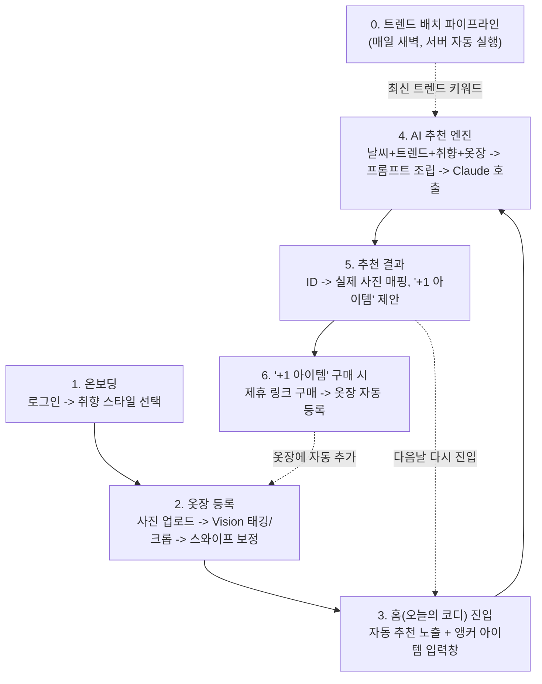

# 아키텍처 (Architecture)

시스템 구성, 사용자 흐름, 배포 구조를 정의한다. 도메인/엔티티 설계는 [domain-design.md](domain-design.md),
코딩 규칙은 [conventions.md](conventions.md)를 참고한다.

---

## 1. 전체 구성도
[Flutter App/Web] --REST/JSON--> [Spring Boot API]
|-- Service --> [Claude API] (Vision + Text)
|-- Service --> [공공 날씨 API]
|-- Scheduler --> [패션 매체/RSS] --> [Claude API 정제] --> [MySQL]
'-- JPA --> [MySQL]
- 클라이언트(Flutter)는 REST API로만 서버와 통신한다.
- 이미지 분석(Vision)은 옷장 등록 시 1회만 호출된다. 이후 추천 요청은 텍스트 프롬프트만 오간다.
- 트렌드 수집은 사용자 요청과 무관하게 서버 스케줄러가 매일 독립적으로 실행한다.

## 2. UI 구조 / 네비게이션

하단 네비게이션은 **홈 · 옷장 · 프로필** 3탭으로 구성한다.

- **홈 = 오늘의 코디.** 앱을 켜자마자 날씨+트렌드 기반으로 자동 뜬 오늘의 추천이 바로 보이고,
  그 위나 아래에 "흰 치마인데 뭐랑 매치하지?" 같은 걸 물어볼 수 있는 입력창(앵커 아이템 요청)이
  함께 있는 화면이다. 탭은 홈(추천 통합) · 옷장 · 프로필 3개로 줄인다. Duolingo나 캘린더 앱처럼
  "켜자마자 오늘 할 일"이 바로 보이는 습관형 앱 패턴이고, 탭이 적을수록 고민 없이 눌리기 때문이다.
  ("홈"과 "옷추천"을 분리하는 대안도 검토했으나, 매일 반복되는 핵심 행동을 진입 즉시 노출하는
  쪽이 습관 형성에 유리하다고 판단해 통합했다.)
- **옷장**: 보유 의류 조회, 사진으로 신규 등록(Vision 태깅 → 크롭 → 스와이프 보정).
- **프로필**: 취향 스타일 태그 설정, 계정/로그아웃.

## 3. 사용자 흐름 (User Flow)

## 4. 배포 구성

| 구성 요소 | 배포처 | 방식 |
|---|---|---|
| 프론트엔드 | **Vercel** | `flutter build web` 산출물(정적 파일)을 배포. Flutter 코드는 모바일/웹 공유. |
| 백엔드(Spring Boot) | **Render 또는 Railway** | GitHub 연동, push 시 자동 빌드·배포 (Vercel이 Java를 지원하지 않아 별도 호스팅) |
| 데이터베이스 | Render/Railway 제공 MySQL, 또는 별도 매니지드 MySQL | 배포처 확정은 [open-decisions.md](open-decisions.md) 참고 |
| AI | Claude API | 서버(Spring Boot)에서만 호출. 클라이언트에 API 키 노출 금지 |

> 로컬 개발 시 웹 화면이 모바일 폭 그대로 늘어나 보이는 문제를 막기 위해, `MaterialApp`을
> 최대 폭(예: 430px) 컨테이너로 감싸고 중앙 정렬 + 여백 배경을 채우는 래퍼를 적용한다.

## 5. 비용 최적화 원칙

- 이미지 분석(Claude Vision)은 옷장 등록 시 **1회만** 수행, 이후 텍스트 태그로만 재사용한다.
- 트렌드 수집은 실시간이 아닌 **일 단위 배치**로 처리해 호출량을 고정한다.
- 추천 엔진은 벡터DB 기반 RAG가 아닌 **프롬프트 조립(Context Injection)** 방식을 사용한다.