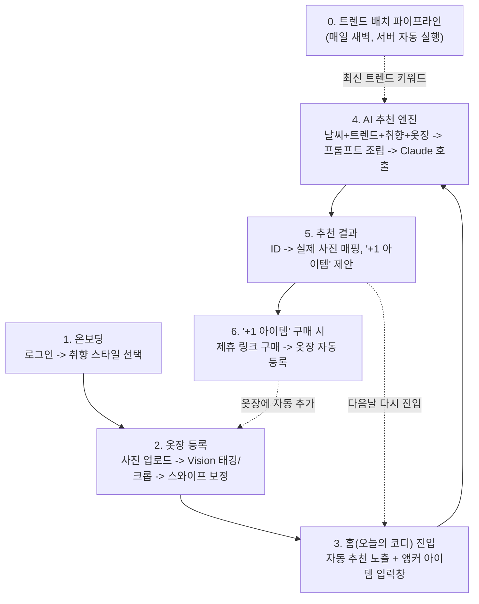

# 아키텍처 (Architecture)

시스템 구성, 사용자 흐름, 배포 구조를 정의한다. 도메인/엔티티 설계는 [domain-design.md](domain-design.md),
코딩 규칙은 [conventions.md](conventions.md)를 참고한다.

---

## 1. 전체 구성도
[Flutter App/Web] --REST/JSON--> [Spring Boot API]
|-- Service --> [Claude API] (Vision + Text)
|-- Service --> [공공 날씨 API]
|-- Scheduler --> [패션 매체/RSS] --> [Claude API 정제] --> [MySQL]
'-- JPA --> [MySQL]
- 클라이언트(Flutter)는 REST API로만 서버와 통신한다.
- 이미지 분석(Vision)은 옷장 등록 시 1회만 호출된다. 이후 추천 요청은 텍스트 프롬프트만 오간다.
- 트렌드 수집은 사용자 요청과 무관하게 서버 스케줄러가 매일 독립적으로 실행한다.

## 2. UI 구조 / 네비게이션

하단 네비게이션은 **홈 · 옷장 · 캘린더 · 프로필** 4탭으로 구성한다. (Figma 디자인 확정, 2026-07-28)

- **홈 = 오늘의 코디.** 앱을 켜자마자 날씨+트렌드 기반으로 자동 뜬 오늘의 추천이 바로 보이고,
  그 위나 아래에 "흰 치마인데 뭐랑 매치하지?" 같은 걸 물어볼 수 있는 입력창(앵커 아이템 요청)이
  함께 있는 화면이다. Duolingo나 캘린더 앱처럼 "켜자마자 오늘 할 일"이 바로 보이는 습관형 앱
  패턴이고, "홈"과 "옷추천"을 분리하지 않고 통합해 매일 반복되는 핵심 행동을 진입 즉시 노출한다.
- **옷장**: 보유 의류 조회, 사진으로 신규 등록(Vision 태깅 → 크롭 → 스와이프 보정).
- **캘린더(위클리 아카이브)**: 주 단위로 그날 추천/기록된 코디를 돌아보는 화면. `RecommendationLog`
  이력을 날짜별로 묶어 보여준다 — PRD상 스트레치 항목이었으나 Figma 디자인 확정과 함께 MVP 범위로
  승격되었다(docs/PRD.md 갱신).
- **프로필**: 취향 스타일 태그 설정, 계정/로그아웃.

> 탭을 3개에서 4개로 늘리는 결정은 "탭이 적을수록 고민 없이 눌린다"는 기존 원칙과 긴장이 있다.
> 다만 캘린더는 매일 반복 입력이 필요한 행동이 아니라 회고용 조회 화면이라 홈의 습관 루프를
> 방해하지 않는다고 판단해, Figma 디자인을 그대로 따르기로 했다.

## 3. 사용자 흐름 (User Flow)

## 4. 배포 구성

| 구성 요소 | 배포처 | 방식 |
|---|---|---|
| 프론트엔드 | **Vercel** | GitHub 연동, Root Directory=`app`. `app/vercel.json`이 `app/vercel-build.sh`를 호출해 빌드 시점에 Flutter SDK를 설치하고 `flutter build web --dart-define=API_BASE_URL=...`로 백엔드 주소를 주입한다(Vercel 프로젝트 환경변수 `API_BASE_URL`로 설정). |
| 백엔드(Spring Boot) | **Railway** (B1, 2026-07-29 결정) | GitHub 연동, Root Directory=`backend`. `backend/Dockerfile`을 자동 감지해 빌드. `PORT`/`DB_URL` 환경변수로 포트·DB 접속 정보를 주입받는다. |
| 데이터베이스 | Railway MySQL 플러그인 | 같은 Railway 프로젝트에 플러그인으로 추가, `DB_URL`/`DB_USERNAME`/`DB_PASSWORD` 환경변수로 백엔드에 연결 |
| 이미지 스토리지 | **Cloudflare R2** (`R2ImageStorage`) | 로컬 파일시스템(`LocalFileImageStorage`)은 Railway 재배포 시 초기화되므로 배포는 R2를 쓴다. `trendfit.storage.provider=r2` + `.env`의 `R2_ACCOUNT_ID`/`R2_ACCESS_KEY_ID`/`R2_SECRET_ACCESS_KEY`/`R2_BUCKET`로 전환 (A4, [open-decisions.md](open-decisions.md)) |
| AI | Claude API | 서버(Spring Boot)에서만 호출. 클라이언트에 API 키 노출 금지 |

> 로컬 개발 시 웹 화면이 모바일 폭 그대로 늘어나 보이는 문제를 막기 위해, `MaterialApp`을
> 최대 폭(예: 430px) 컨테이너로 감싸고 중앙 정렬 + 여백 배경을 채우는 래퍼를 적용한다.

## 5. 비용 최적화 원칙

- 이미지 분석(Claude Vision)은 옷장 등록 시 **1회만** 수행, 이후 텍스트 태그로만 재사용한다.
- 트렌드 수집은 실시간이 아닌 **일 단위 배치**로 처리해 호출량을 고정한다.
- 추천 엔진은 벡터DB 기반 RAG가 아닌 **프롬프트 조립(Context Injection)** 방식을 사용한다.